# AI Transport Optimizer - Complete Architecture Guide

> **Comprehensive technical documentation covering the entire system architecture, AI engine, Next.js application, MCP server, APIs, authentication, database, and user flows.**

---

## 📑 Table of Contents

1. [System Overview](#system-overview)
2. [Repository Structure](#repository-structure)
3. [AI Optimization Engine](#ai-optimization-engine)
4. [Next.js Application Architecture](#nextjs-application-architecture)
5. [API Layer](#api-layer)
6. [MCP Server](#mcp-server)
7. [Database Schema](#database-schema)
8. [Authentication & Authorization](#authentication--authorization)
9. [User Flows](#user-flows)
10. [Admin Flows](#admin-flows)
11. [Data Flow Diagrams](#data-flow-diagrams)
12. [Integration Points](#integration-points)

---

## 1. System Overview

### High-Level Architecture

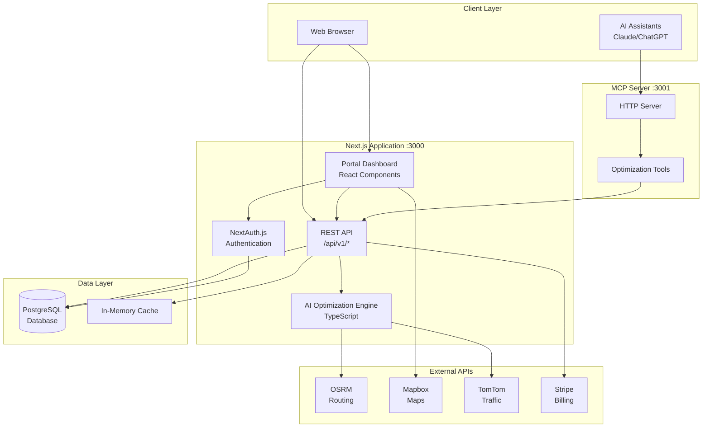

### Core Components

| Component | Technology | Purpose |
|-----------|-----------|---------|
| **Frontend** | Next.js 15 + React 19 | Portal dashboard, admin panel |
| **Backend** | Next.js API Routes | REST API endpoints |
| **AI Engine** | TypeScript | Route optimization algorithms |
| **Database** | PostgreSQL + Prisma | User data, API keys, billing |
| **Authentication** | NextAuth.js v5 | User auth, sessions, OAuth |
| **MCP Server** | Express.js | AI assistant integration |
| **Caching** | In-Memory | Performance optimization |
| **Maps** | OSRM + Mapbox | Routing and visualization |
| **Billing** | Stripe | Subscription management |

---

## 2. Repository Structure

### Directory Organization

```
ai-transport-optimizer-v3-mcp/
├── src/                          # Next.js application
│   ├── app/                      # App Router pages & API routes
│   │   ├── (auth)/              # Authentication pages
│   │   ├── (portal)/            # Portal dashboard pages
│   │   ├── admin/               # Admin panel pages
│   │   └── api/                 # API endpoints
│   │       ├── v1/              # Versioned API
│   │       ├── auth/            # Auth endpoints
│   │       ├── portal/          # Portal API
│   │       └── admin/           # Admin API
│   ├── lib/                     # Core libraries
│   │   ├── ai-engine/           # ⭐ Optimization algorithms
│   │   ├── auth/                # Auth utilities
│   │   ├── api/                 # API helpers
│   │   ├── api-keys/            # API key management
│   │   ├── billing/             # Stripe integration
│   │   └── db/                  # Database client
│   ├── components/              # React components
│   │   ├── ui/                  # Reusable UI components
│   │   └── portal/              # Portal-specific components
│   └── middleware.ts            # Route middleware
│
├── mcp-server/                  # MCP Server
│   └── src/
│       ├── index.ts             # STDIO server
│       ├── http-server.ts       # HTTP server
│       ├── tools/               # MCP tools
│       └── schemas/             # Validation schemas
│
├── prisma/
│   └── schema.prisma            # Database schema
│
├── public/                      # Static files
│   ├── demo.html               # Demo app
│   └── api-demo.html           # API testing interface
│
└── scripts/                     # Utility scripts
```

### Key File Purposes

| File/Directory | Purpose |
|----------------|---------|
| `src/lib/ai-engine/` | All optimization algorithms and logic |
| `src/app/api/v1/` | Public API endpoints for optimization |
| `src/app/(portal)/` | Portal dashboard UI |
| `src/app/admin/` | Admin panel UI |
| `mcp-server/src/` | MCP protocol server for AI assistants |
| `prisma/schema.prisma` | Database models and relationships |

---

## 3. AI Optimization Engine

### Engine Architecture

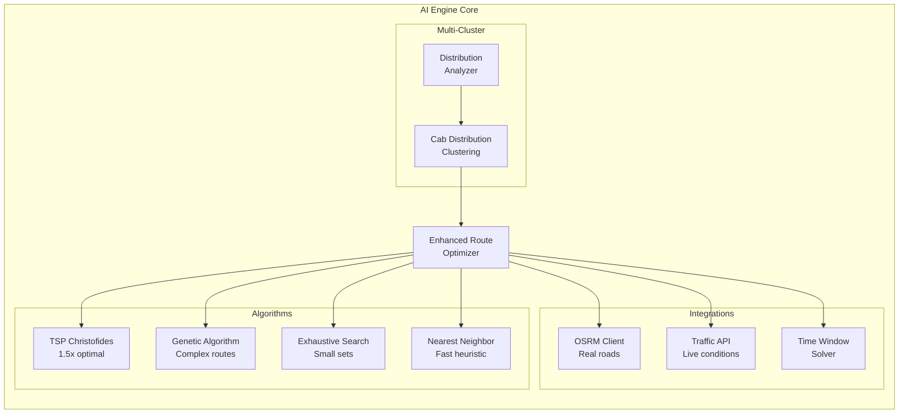

### Algorithm Selection Logic

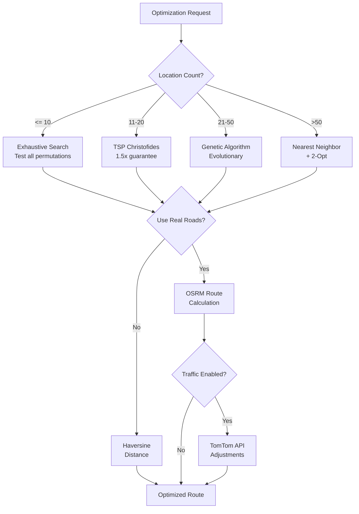

### Core Engine Files

```
src/lib/ai-engine/
├── index.ts                         # Main exports
├── types.ts                        # TypeScript definitions
│
├── enhanced-route-optimizer.ts     # ⭐ Main optimizer entry point
├── tsp-christofides.ts             # Christofides algorithm
├── genetic-algorithm.ts            # Genetic algorithm
├── exhaustive-testing.ts           # Exhaustive search
│
├── osrm-client.ts                  # OSRM API integration
├── mapbox-directions.ts            # Mapbox Directions API
├── traffic-integration.ts          # TomTom Traffic API
├── time-window-solver.ts           # Time constraint handling
│
├── cab-distribution.ts             # Vehicle assignment
└── distribution-analyzer.ts        # Multi-cluster analysis
```

### Algorithm Details

#### 1. TSP Christofides Algorithm

**File:** `tsp-christofides.ts`

**Purpose:** Provides 1.5x optimal guarantee for TSP

**Process:**
1. Build Minimum Spanning Tree (MST)
2. Find odd-degree vertices
3. Compute minimum-weight perfect matching
4. Create Eulerian circuit
5. Apply 2-Opt improvements

**Complexity:** O(n³)

#### 2. Genetic Algorithm

**File:** `genetic-algorithm.ts`

**Purpose:** Handle complex routes with 20+ locations

**Parameters:**
- Population: 50 individuals
- Generations: 100
- Mutation Rate: 0.15
- Elite Retention: Top 10%

**Operators:**
- Selection: Tournament
- Crossover: Order Crossover (OX)
- Mutation: Swap mutation

#### 3. Multi-Cluster Optimization

**File:** `cab-distribution.ts` + `distribution-analyzer.ts`

**Process:**
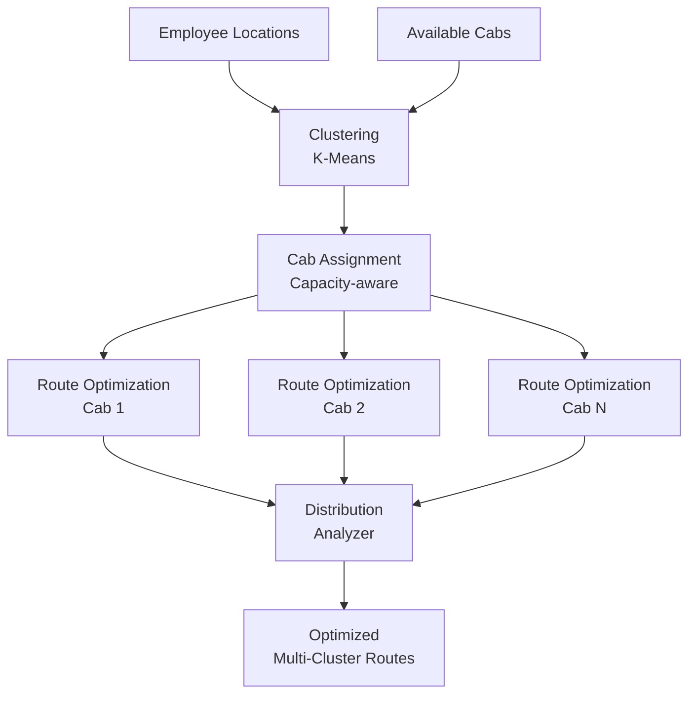

**Features:**
- Geographic clustering
- Capacity constraints
- Workload balancing
- Cost optimization

---

## 4. Next.js Application Architecture

### App Router Structure

```mermaid
graph TD
    subgraph "Public Routes"
        HOME[/ - Landing Page]
        DEMO[/demo-ai-optimizer - Demo]
    end

    subgraph "Auth Routes (auth)"
        LOGIN[/login]
        SIGNUP[/signup]
        VERIFY[/verify-email]
    end

    subgraph "Portal Routes (portal)"
        DASH[/dashboard - Overview]
        API_KEYS[/api-keys - Key Management]
        USAGE[/usage - Usage Stats]
        BILLING[/billing - Subscription]
        SETTINGS[/settings - User Settings]
    end

    subgraph "Admin Routes"
        ADMIN_DASH[/admin/dashboard]
        ADMIN_USERS[/admin/users]
        ADMIN_KEYS[/admin/api-keys]
        ADMIN_ANALYTICS[/admin/analytics]
        ADMIN_AUDIT[/admin/audit]
    end

    subgraph "API Routes"
        API_V1[/api/v1/* - Public API]
        API_AUTH[/api/auth/* - NextAuth]
        API_PORTAL[/api/portal/* - Portal API]
        API_ADMIN[/api/admin/* - Admin API]
    end
```

### Component Architecture

```
src/components/
├── ui/                          # Shadcn UI components
│   ├── button.tsx
│   ├── card.tsx
│   ├── input.tsx
│   └── ...
│
└── portal/                      # Portal-specific
    ├── layout/
    │   ├── portal-layout.tsx    # Main layout wrapper
    │   └── sidebar.tsx          # Navigation sidebar
    │
    ├── dashboard/
    │   ├── stats-card.tsx       # Metrics display
    │   └── usage-chart.tsx      # Charts
    │
    ├── api-keys/
    │   ├── create-key-modal.tsx
    │   ├── key-display.tsx
    │   └── key-list.tsx
    │
    └── billing/
        ├── plan-card.tsx
        └── payment-form.tsx
```

### Middleware Flow

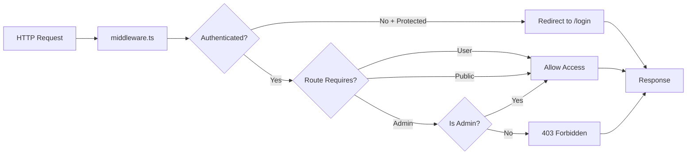

**File:** `src/middleware.ts`

**Protected Routes:**
- `/dashboard/*` - Requires authentication
- `/admin/*` - Requires admin role
- `/api-keys/*` - Requires authentication
- `/billing/*` - Requires authentication

---

## 5. API Layer

### API Endpoint Structure

```mermaid
graph TB
    subgraph "Public API /api/v1"
        HEALTH[/health - Status]
        
        ROUTE[/optimize/route - Single Route]
        MULTI[/optimize/multi-cluster - Multi-Cab]
        
        MATRIX[/matrix/distance - Distance Matrix]
        
        ALGOS[/algorithms - List Algorithms]
        METRICS[/metrics - System Metrics]
    end

    subgraph "Portal API /api/portal"
        KEYS[/keys - API Key CRUD]
        USAGE_API[/usage - Usage Stats]
        STATS[/stats - Dashboard Stats]
    end

    subgraph "Admin API /api/admin"
        USERS[/users - User Management]
        ADMIN_KEYS[/api-keys - All Keys]
        ANALYTICS[/analytics - System Analytics]
        AUDIT[/audit - Audit Logs]
        CONFIG[/config - System Config]
    end

    subgraph "Auth API /api/auth"
        LOGIN_API[/signin - Login]
        SIGNUP_API[/signup - Register]
        SESSION[/session - Current Session]
    end
```

### API Request Flow

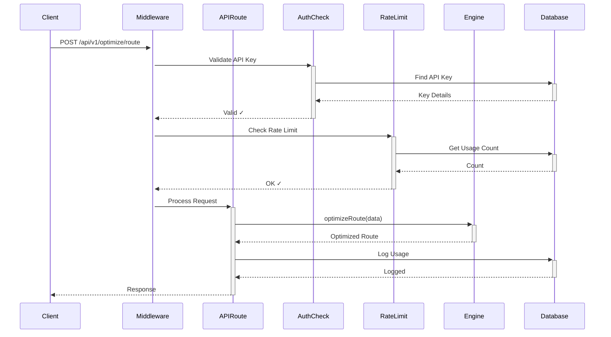

### API Authentication

All `/api/v1/*` endpoints require **API Key** via header:

```http
X-API-Key: ropt_xxxxxxxxxxxxxxxxxxxxxxxxxxxxxxxx
```

**Rate Limiting:**
- Default: 100 requests / 15 minutes
- Configurable per API key
- Tracked in database

---

## 6. MCP Server

### MCP Architecture

```mermaid
graph TB
    subgraph "AI Assistants"
        CLAUDE[Claude Desktop]
        CHATGPT[ChatGPT]
        CUSTOM[Custom Clients]
    end

    subgraph "MCP Server :3001"
        HTTP[HTTP Server<br/>Express.js]
        STDIO[STDIO Server<br/>stdio transport]
        
        TOOLS[MCP Tools]
        SCHEMAS[Zod Schemas]
        
        subgraph "Available Tools"
            TOOL1[optimize_route]
            TOOL2[optimize_multi_cluster]
            TOOL3[calculate_distance_matrix]
        end
    end

    subgraph "Main App API"
        API_V1[/api/v1/*<br/>Endpoints]
    end

    CLAUDE -.STDIO.-> STDIO
    CHATGPT -.HTTP.-> HTTP
    CUSTOM -.HTTP.-> HTTP
    
    HTTP --> TOOLS
    STDIO --> TOOLS
    
    TOOLS --> TOOL1
    TOOLS --> TOOL2
    TOOLS --> TOOL3
    
    TOOL1 --> API_V1
    TOOL2 --> API_V1
    TOOL3 --> API_V1
```

### MCP Server Files

```
mcp-server/src/
├── index.ts              # STDIO server (Claude Desktop)
├── http-server.ts        # HTTP server (web clients)
├── config.ts             # Configuration
├── logger.ts             # Logging
├── errors.ts             # Error handling
│
├── tools/
│   └── ai-engine-handlers.ts   # Tool implementations
│
└── schemas/
    └── validation.ts            # Input validation
```

### MCP Tool Definitions

#### 1. optimize_route

**Description:** Optimize a single route for one vehicle

**Input Schema:**
```typescript
{
  origin: Location,
  destinations: Location[],
  tripType: "pickup" | "dropoff",
  options?: {
    algorithm?: "auto" | "nearest_neighbor" | "christofides" | "genetic",
    useRealRoads?: boolean,
    considerTraffic?: boolean
  }
}
```

**Output:** Optimized route with stops, distance, duration

#### 2. optimize_multi_cluster

**Description:** Optimize routes for multiple vehicles

**Input Schema:**
```typescript
{
  employees: Location[],
  office: Location,
  cabs: Array<{id: string, capacity: number}>,
  tripType: "pickup" | "dropoff"
}
```

**Output:** Multiple optimized routes with cab assignments

#### 3. calculate_distance_matrix

**Description:** Calculate distance/duration matrix

**Input Schema:**
```typescript
{
  coordinates: Array<{lat: number, lng: number}>
}
```

**Output:** Distance and duration matrices

---

## 7. Database Schema

### Entity Relationship Diagram

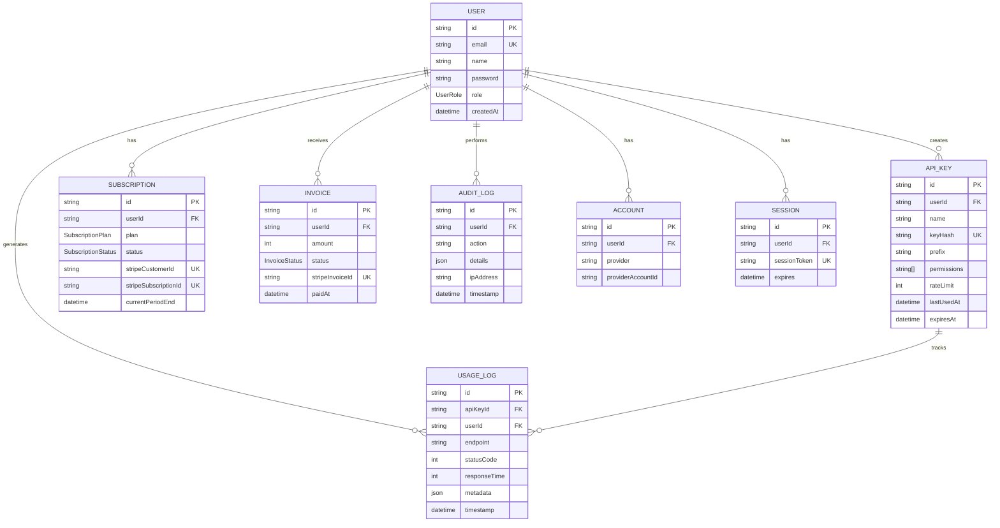

### Key Tables

| Table | Purpose | Key Fields |
|-------|---------|------------|
| **users** | User accounts | email, role, password |
| **api_keys** | API authentication | keyHash, permissions, rateLimit |
| **subscriptions** | Billing plans | plan, status, stripeCustomerId |
| **usage_logs** | API usage tracking | endpoint, responseTime, metadata |
| **invoices** | Payment records | amount, status, stripeInvoiceId |
| **audit_logs** | Admin activity | action, details, ipAddress |

---

## 8. Authentication & Authorization

### Authentication Flow

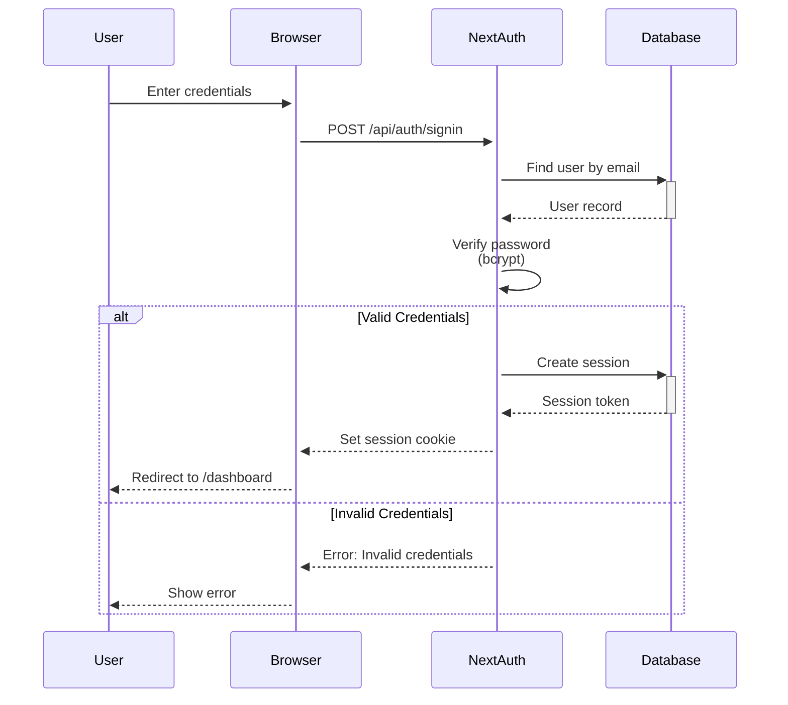

### Role-Based Access Control

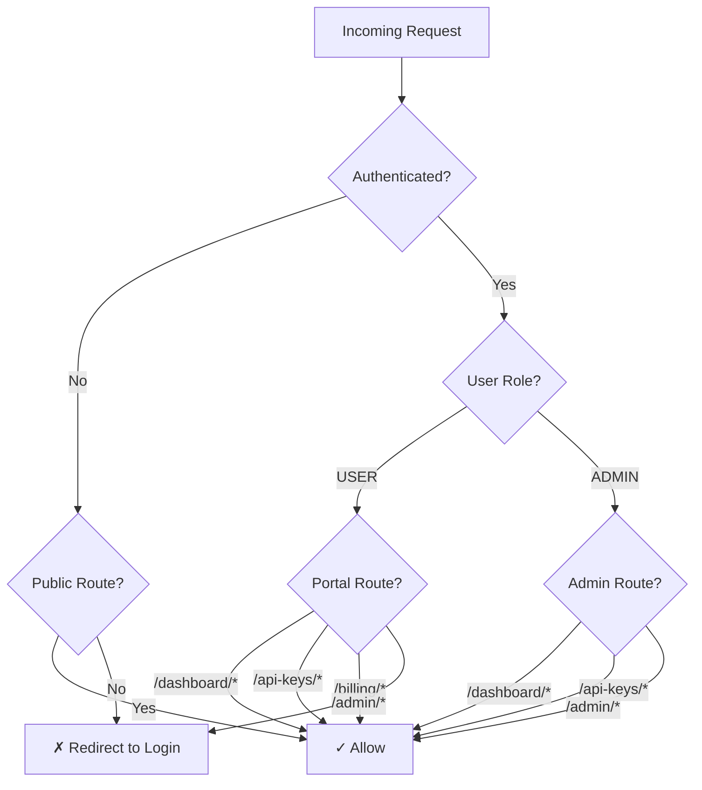

**Roles:**
- `USER` - Regular users, access to portal
- `ADMIN` - Administrators, access to admin panel + portal

**Protected Routes:**
```typescript
// middleware.ts
const protectedRoutes = [
  '/dashboard',
  '/api-keys',
  '/billing',
  '/usage',
  '/settings'
];

const adminRoutes = [
  '/admin'
];
```

---

## 9. User Flows

### User Registration & Onboarding

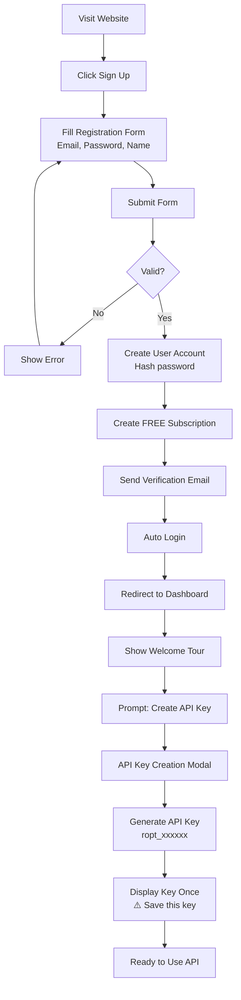

### API Key Creation Flow

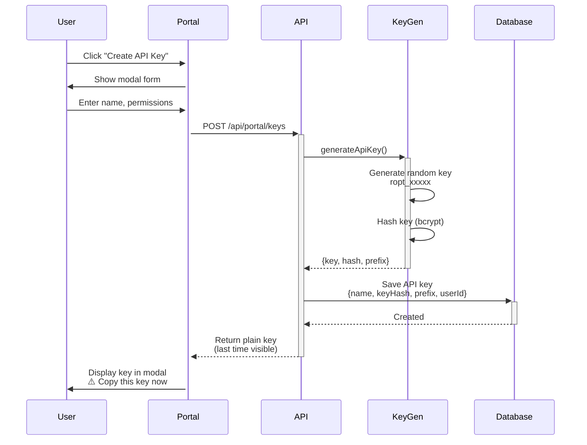

### API Usage Flow

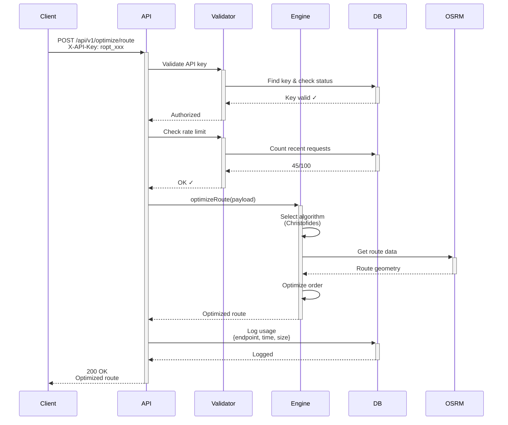

---

## 10. Admin Flows

### Admin Dashboard Overview

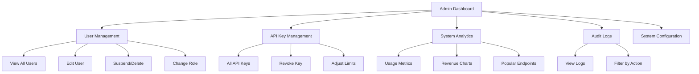

### User Management Flow

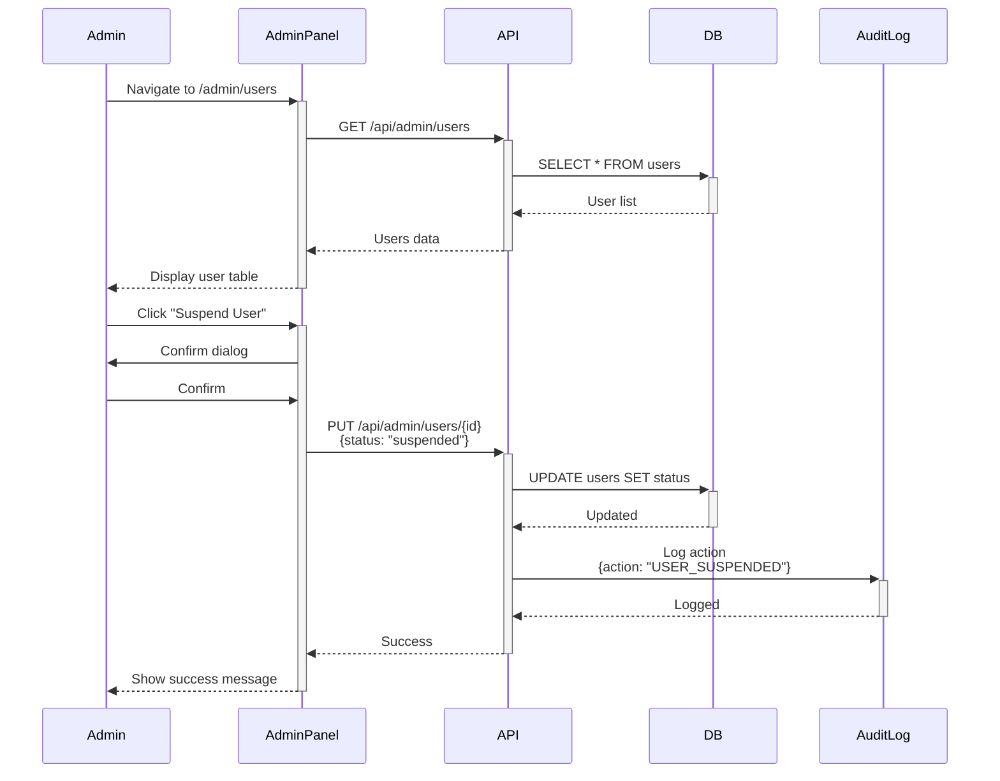

### Analytics Data Flow

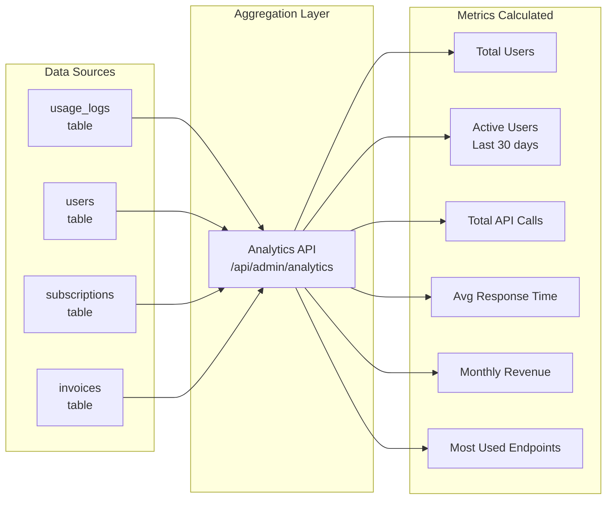

---

## 11. Data Flow Diagrams

### Complete Request Lifecycle

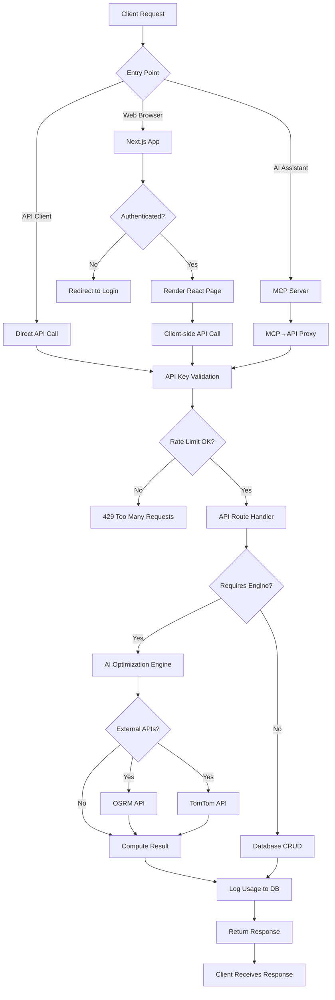

### Multi-Cluster Optimization Flow

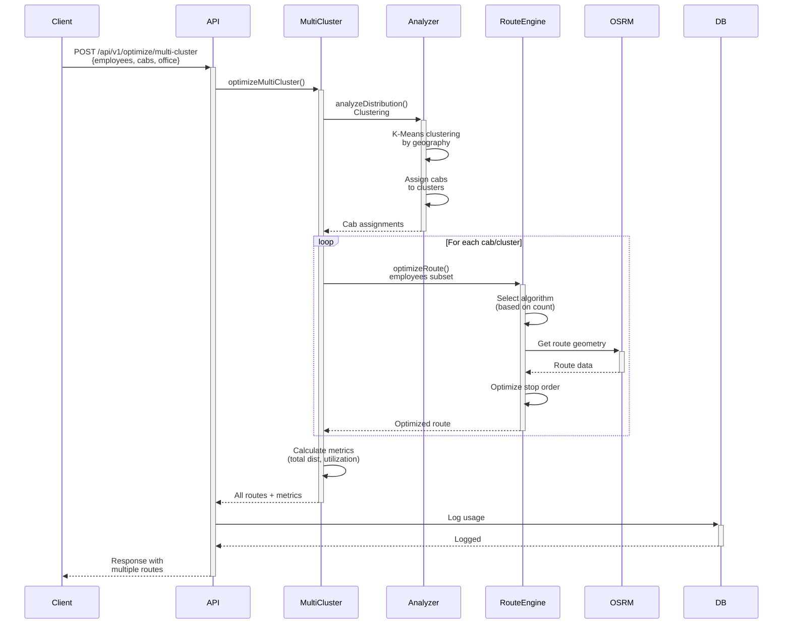

---

## 12. Integration Points

### External Service Integrations

```mermaid
graph TB
    subgraph "Application Core"
        APP[Next.js App]
        ENGINE[AI Engine]
    end

    subgraph "Routing Services"
        OSRM[OSRM Server<br/>Open Source]
        MAPBOX[Mapbox Directions<br/>Commercial]
    end

    subgraph "Traffic Data"
        TOMTOM[TomTom Traffic API<br/>Commercial]
    end

    subgraph "Maps & Visualization"
        MAPBOX_MAPS[Mapbox GL JS<br/>Frontend Maps]
    end

    subgraph "Payment Processing"
        STRIPE[Stripe API<br/>Subscriptions]
        STRIPE_WEBHOOKS[Stripe Webhooks<br/>Events]
    end

    subgraph "Email Service"
        RESEND[Resend API<br/>Transactional Email]
    end

    ENGINE -->|Route calculation| OSRM
    ENGINE -->|Alternative| MAPBOX
    ENGINE -->|Traffic data| TOMTOM
    
    APP -->|Map display| MAPBOX_MAPS
    APP -->|Subscriptions| STRIPE
    STRIPE_WEBHOOKS -->|Payment events| APP
    APP -->|Send emails| RESEND
```

### Integration Details

| Service | Purpose | Configuration | Fallback |
|---------|---------|---------------|----------|
| **OSRM** | Primary routing | `OSRM_SERVER_URL` | Use Haversine distance |
| **Mapbox** | Map visualization | `NEXT_PUBLIC_MAPBOX_TOKEN` | No map display |
| **TomTom** | Live traffic | `TOMTOM_API_KEY` | Static time estimates |
| **Stripe** | Billing | `STRIPE_SECRET_KEY` | Manual billing |
| **Resend** | Email | `RESEND_API_KEY` | No emails |

---

## Summary

This architecture guide covers:

✅ **System Overview** - High-level architecture and components  
✅ **Repository Structure** - File organization and purposes  
✅ **AI Engine** - 10+ optimization algorithms and selection logic  
✅ **Next.js App** - App Router, components, middleware  
✅ **API Layer** - Public API, Portal API, Admin API endpoints  
✅ **MCP Server** - AI assistant integration via MCP protocol  
✅ **Database** - PostgreSQL schema with Prisma ORM  
✅ **Authentication** - NextAuth.js with role-based access  
✅ **User Flows** - Registration, API key creation, usage  
✅ **Admin Flows** - User management, analytics, audit logs  
✅ **Data Flows** - Request lifecycle and optimization flows  
✅ **Integrations** - External APIs and services  

### Key Takeaways

1. **Monolithic Next.js App**: Single application handles everything - frontend, backend, API, auth
2. **AI Engine Core**: Sophisticated optimization with multiple algorithms (Christofides, Genetic, Exhaustive)
3. **MCP Integration**: Enables AI assistants to use optimization tools
4. **Database-Driven**: PostgreSQL stores all user data, API keys, usage logs
5. **Role-Based Access**: USER and ADMIN roles with middleware protection
6. **API-First Design**: Public API for external clients, internal API for portal
7. **Scalable Architecture**: Caching, rate limiting, microservice-ready structure
