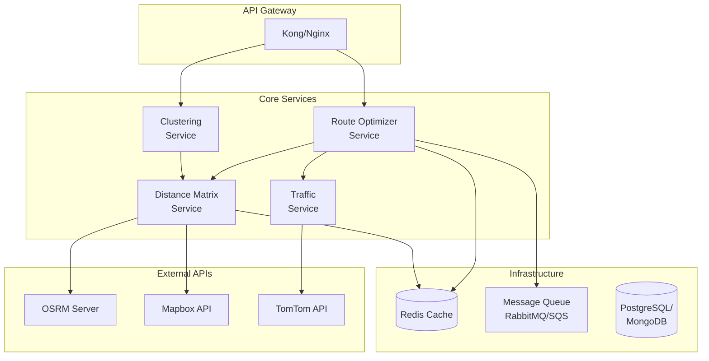
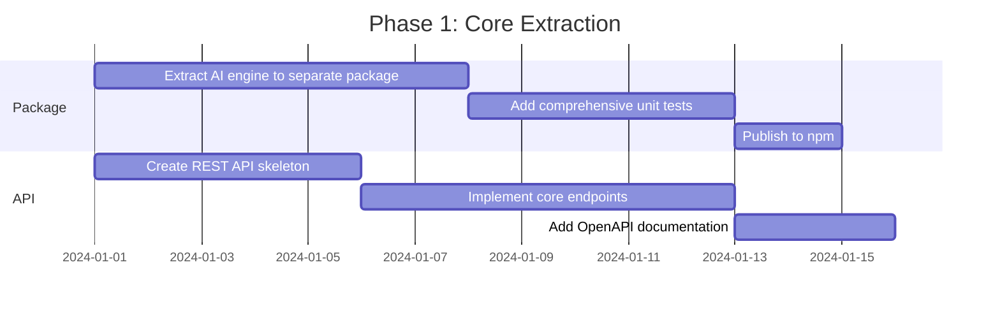

# 🚀 AI Transport Optimizer: Scalability, Integration & API Guide

> A comprehensive guide for making the AI Transport Optimizer scalable, easily integrable into any application, and API-ready for production deployment.

---

## 📋 Table of Contents

1. [Executive Summary](#executive-summary)
2. [Current Architecture Analysis](#current-architecture-analysis)
3. [Making It Scalable](#making-it-scalable)
4. [API-First Design](#api-first-design)
5. [Integration Patterns](#integration-patterns)
6. [Microservices Architecture](#microservices-architecture)
7. [Performance Optimization](#performance-optimization)
8. [Deployment Strategies](#deployment-strategies)
9. [Testing & Monitoring](#testing--monitoring)
10. [Security Considerations](#security-considerations)
11. [Implementation Roadmap](#implementation-roadmap)

---

## Executive Summary

The **AI Transport Optimizer** is a powerful route optimization engine featuring multiple algorithms (Christofides TSP, Genetic Algorithm, Nearest Neighbor), real-road routing via OSRM/Mapbox, traffic integration, and multi-cluster cab distribution. This guide provides a complete blueprint for:

- **Scaling** the system to handle thousands of concurrent requests
- **Integrating** into any tech stack (React, Angular, Vue, Mobile, Backend services)
- **Exposing** as a standalone REST/GraphQL API
- **Deploying** in cloud-native environments

---

## Current Architecture Analysis

### 📁 Codebase Structure

```
ai-transport-optimizer-standalone-v2/
├── src/
│   ├── app/
│   │   ├── api/osrm/route.ts          # OSRM proxy (Edge runtime)
│   │   └── demo-ai-optimizer/          # Demo UI
│   └── lib/
│       ├── ai-engine/                  # Core optimization engine
│       │   ├── index.ts                # Public exports
│       │   ├── types.ts                # TypeScript interfaces
│       │   ├── enhanced-route-optimizer.ts
│       │   ├── tsp-christofides.ts
│       │   ├── genetic-algorithm.ts
│       │   ├── osrm-client.ts
│       │   ├── mapbox-directions.ts
│       │   ├── traffic-integration.ts
│       │   ├── time-window-solver.ts
│       │   ├── cab-distribution.ts
│       │   ├── distribution-analyzer.ts
│       │   └── exhaustive-testing.ts
│       ├── multi-cluster-optimizer.ts  # Clustering & assignment
│       └── csv-parser.ts               # Data ingestion
```

### 🔍 Current Strengths

| Aspect | Current Status |
|--------|----------------|
| **Algorithm Quality** | ✅ Production-grade TSP, GA, Christofides |
| **Type Safety** | ✅ Full TypeScript with rich interfaces |
| **Modularity** | ✅ Clean separation of concerns |
| **Real Road Routing** | ✅ OSRM + Mapbox integration |
| **Traffic Awareness** | ✅ TomTom API integration |

### ⚠️ Current Limitations

| Aspect | Current Status | Solution |
|--------|----------------|----------|
| **Coupling** | Tight Next.js integration | Extract to standalone package |
| **API Layer** | Single OSRM proxy | Full REST/GraphQL API |
| **State Management** | In-memory only | Add persistence layer |
| **Horizontal Scaling** | Not designed for | Add stateless architecture |
| **Rate Limiting** | None | Add API gateway |

---

## Making It Scalable

### Strategy 1: Extract Core Engine as NPM Package

The first step to scalability is decoupling the AI engine from the Next.js frontend.

#### 📦 Package Structure

```
@routify/ai-transport-optimizer/
├── src/
│   ├── core/
│   │   ├── algorithms/
│   │   │   ├── nearest-neighbor.ts
│   │   │   ├── christofides.ts
│   │   │   ├── genetic-algorithm.ts
│   │   │   └── exhaustive.ts
│   │   ├── routing/
│   │   │   ├── osrm-client.ts
│   │   │   ├── mapbox-client.ts
│   │   │   └── traffic-client.ts
│   │   ├── clustering/
│   │   │   ├── k-means.ts
│   │   │   └── cab-assignment.ts
│   │   └── distribution/
│   │       ├── cab-distribution.ts
│   │       └── distribution-analyzer.ts
│   ├── types/
│   │   └── index.ts
│   ├── utils/
│   │   ├── haversine.ts
│   │   ├── time-parser.ts
│   │   └── polyline.ts
│   └── index.ts
├── package.json
├── tsconfig.json
└── README.md
```

#### 📄 Package.json Configuration

```json
{
  "name": "@routify/ai-transport-optimizer",
  "version": "1.0.0",
  "main": "dist/index.js",
  "module": "dist/index.mjs",
  "types": "dist/index.d.ts",
  "exports": {
    ".": {
      "import": "./dist/index.mjs",
      "require": "./dist/index.js",
      "types": "./dist/index.d.ts"
    },
    "./algorithms": {
      "import": "./dist/algorithms/index.mjs",
      "require": "./dist/algorithms/index.js"
    },
    "./types": {
      "import": "./dist/types/index.mjs",
      "require": "./dist/types/index.js"
    }
  },
  "sideEffects": false,
  "peerDependencies": {
    "typescript": ">=4.7.0"
  },
  "engines": {
    "node": ">=18.0.0"
  }
}
```

---

### Strategy 2: Stateless Architecture

For horizontal scaling, the optimizer must be **stateless**. Here's how to achieve this:

#### ❌ Current Approach (Stateful)

```typescript
// Anti-pattern: Module-level state
let cachedDistanceMatrix: number[][] | null = null;
let lastOptimizationResult: OptimizedRoute | null = null;

export async function optimizeRoute(input: RouteOptimizationInput) {
    // Uses cached state - not scalable!
    if (cachedDistanceMatrix) {
        return quickOptimize(cachedDistanceMatrix);
    }
}
```

#### ✅ Scalable Approach (Stateless)

```typescript
// Pattern: Pure functions with explicit context
export interface OptimizationContext {
    distanceMatrix?: number[][];
    durationMatrix?: number[][];
    algorithmCache?: Map<string, any>;
    requestId: string;
}

export async function optimizeRoute(
    input: RouteOptimizationInput,
    context: OptimizationContext = { requestId: crypto.randomUUID() }
): Promise<RouteOptimizationOutput> {
    // All state is passed explicitly
    const matrices = context.distanceMatrix 
        ? { distance: context.distanceMatrix, duration: context.durationMatrix! }
        : await buildMatrices(input.origin, input.destinations);
    
    return runOptimization(input, matrices, context);
}
```

---

### Strategy 3: Worker-Based Processing

For CPU-intensive optimization, offload to worker threads:

```typescript
// optimization-worker.ts
import { parentPort, workerData } from 'worker_threads';
import { optimizeWithGeneticAlgorithm } from './genetic-algorithm';

if (parentPort) {
    const result = await optimizeWithGeneticAlgorithm(
        workerData.distanceMatrix,
        workerData.durationMatrix,
        workerData.config
    );
    parentPort.postMessage(result);
}
```

```typescript
// optimizer-pool.ts
import { Worker } from 'worker_threads';
import { cpus } from 'os';

class OptimizerPool {
    private workers: Worker[] = [];
    private queue: Array<{ resolve: Function; reject: Function; data: any }> = [];
    private available: Worker[] = [];

    constructor(private poolSize = cpus().length - 1) {
        for (let i = 0; i < poolSize; i++) {
            const worker = new Worker('./optimization-worker.ts');
            worker.on('message', this.handleResult.bind(this, worker));
            worker.on('error', this.handleError.bind(this, worker));
            this.workers.push(worker);
            this.available.push(worker);
        }
    }

    async optimize(data: any): Promise<any> {
        return new Promise((resolve, reject) => {
            this.queue.push({ resolve, reject, data });
            this.processQueue();
        });
    }

    private processQueue() {
        while (this.queue.length > 0 && this.available.length > 0) {
            const worker = this.available.pop()!;
            const task = this.queue.shift()!;
            worker.postMessage(task.data);
        }
    }
}
```

---

### Strategy 4: Caching Layer

Implement multi-tier caching for expensive operations:

```typescript
// cache-layer.ts
import Redis from 'ioredis';

interface CacheConfig {
    redis?: Redis;
    localTTL?: number;      // Local cache TTL in seconds
    redisTTL?: number;      // Redis cache TTL in seconds
}

class OptimizationCache {
    private localCache = new Map<string, { data: any; expiry: number }>();
    private redis: Redis | null;
    
    constructor(private config: CacheConfig = {}) {
        this.redis = config.redis || null;
    }

    // Generate cache key from input
    private getCacheKey(input: RouteOptimizationInput): string {
        const coords = [
            input.origin,
            ...input.destinations.map(d => ({ lat: d.lat, lng: d.lng }))
        ];
        const hash = crypto
            .createHash('md5')
            .update(JSON.stringify(coords))
            .digest('hex');
        return `route:${hash}`;
    }

    // Get distance matrix from cache
    async getDistanceMatrix(
        coordinates: Coordinate[]
    ): Promise<number[][] | null> {
        const key = `matrix:${this.hashCoordinates(coordinates)}`;
        
        // L1: Local memory cache
        const local = this.localCache.get(key);
        if (local && local.expiry > Date.now()) {
            return local.data;
        }
        
        // L2: Redis cache
        if (this.redis) {
            const cached = await this.redis.get(key);
            if (cached) {
                const data = JSON.parse(cached);
                this.localCache.set(key, { 
                    data, 
                    expiry: Date.now() + (this.config.localTTL || 300) * 1000 
                });
                return data;
            }
        }
        
        return null;
    }

    // Cache OSRM route geometry 
    async cacheRoute(
        from: Coordinate, 
        to: Coordinate, 
        geometry: string,
        duration: number,
        distance: number
    ): Promise<void> {
        const key = `segment:${this.hashPair(from, to)}`;
        const data = { geometry, duration, distance };
        
        this.localCache.set(key, {
            data,
            expiry: Date.now() + (this.config.localTTL || 3600) * 1000
        });
        
        if (this.redis) {
            await this.redis.setex(
                key,
                this.config.redisTTL || 86400,
                JSON.stringify(data)
            );
        }
    }
}
```

---

## API-First Design

### REST API Design

Transform the optimizer into a standalone REST API service.

#### 🔗 API Endpoints

```
Base URL: /api/v1

# Route Optimization
POST   /optimize/route              # Single route optimization
POST   /optimize/multi-cluster      # Multi-cab cluster optimization
POST   /optimize/batch              # Batch optimization (async)
GET    /optimize/job/:jobId         # Get batch job status

# Distance Matrix
POST   /matrix/distance             # Get distance/duration matrix
POST   /matrix/traffic              # Get traffic-adjusted matrix

# Utilities
POST   /geocode/batch               # Batch geocoding
GET    /health                      # Health check
GET    /algorithms                  # List available algorithms
```

#### 📝 API Schema Definitions

```typescript
// api-schemas.ts

// Request: Single Route Optimization
export interface OptimizeRouteRequest {
    origin: {
        lat: number;
        lng: number;
        name?: string;
        address?: string;
    };
    destinations: Array<{
        id: string;
        lat: number;
        lng: number;
        name?: string;
        address?: string;
        preferredPickupTime?: string;  // "HH:mm"
        timeWindowStart?: string;
        timeWindowEnd?: string;
    }>;
    tripType: 'pickup' | 'drop';
    constraints: {
        departureTime: string;         // "HH:mm"
        maxTotalDuration?: number;     // minutes
        bufferPerStop?: number;        // minutes per stop
    };
    options?: {
        algorithm?: 'nearest_neighbor' | 'christofides' | 'genetic' | 'auto';
        useRealRoads?: boolean;        // Use OSRM/Mapbox
        considerTraffic?: boolean;     // Apply traffic data
        generateAlternatives?: boolean;
        maxAlternatives?: number;
        timeout?: number;              // Max processing time (ms)
    };
}

// Response: Route Optimization
export interface OptimizeRouteResponse {
    success: boolean;
    requestId: string;
    processingTimeMs: number;
    result: {
        route: {
            id: string;
            stops: Array<{
                sequence: number;
                location: Location;
                arrivalTime: string;
                departureTime: string;
                distanceFromPrevious: number;
                durationFromPrevious: number;
            }>;
            totalDistance: number;       // km
            totalDuration: number;       // minutes
            estimatedArrival: string;
            geometry?: string;           // Encoded polyline
        };
        metrics: {
            algorithmUsed: string;
            optimizationDuration: number;
            improvementOverNaive: number; // percentage
            efficiencyScore: number;      // 0-100
        };
        alternatives?: Array<{
            route: Route;
            description: string;
            comparisonToMain: {
                distanceDiff: number;
                durationDiff: number;
            };
        }>;
    };
    errors?: string[];
}

// Request: Multi-Cluster Optimization
export interface MultiClusterRequest {
    office: {
        lat: number;
        lng: number;
        name: string;
    };
    employees: Array<{
        id: string;
        name: string;
        lat: number;
        lng: number;
        address?: string;
    }>;
    cabs: Array<{
        id: string;
        name: string;
        capacity: number;
        currentLocation?: {
            lat: number;
            lng: number;
        };
    }>;
    config?: {
        maxIterations?: number;
        routeOptimizationAlgorithm?: string;
    };
}
```

---

### OpenAPI Specification

```yaml
# openapi.yaml
openapi: 3.1.0
info:
  title: AI Transport Optimizer API
  version: 1.0.0
  description: |
    Production-grade route optimization API featuring multiple algorithms,
    real-road routing, traffic awareness, and multi-cluster optimization.
  contact:
    name: Routify Support
    url: https://routify.example.com
  license:
    name: MIT
    url: https://opensource.org/licenses/MIT

servers:
  - url: https://api.routify.example.com/v1
    description: Production
  - url: https://staging-api.routify.example.com/v1
    description: Staging

paths:
  /optimize/route:
    post:
      summary: Optimize a single route
      operationId: optimizeRoute
      tags: [Optimization]
      requestBody:
        required: true
        content:
          application/json:
            schema:
              $ref: '#/components/schemas/OptimizeRouteRequest'
      responses:
        '200':
          description: Successful optimization
          content:
            application/json:
              schema:
                $ref: '#/components/schemas/OptimizeRouteResponse'
        '400':
          $ref: '#/components/responses/BadRequest'
        '429':
          $ref: '#/components/responses/RateLimitExceeded'
        '500':
          $ref: '#/components/responses/InternalError'

  /optimize/multi-cluster:
    post:
      summary: Optimize routes for multiple cabs
      operationId: optimizeMultiCluster
      tags: [Optimization]
      requestBody:
        required: true
        content:
          application/json:
            schema:
              $ref: '#/components/schemas/MultiClusterRequest'
      responses:
        '200':
          description: Successful multi-cluster optimization

  /matrix/distance:
    post:
      summary: Calculate distance matrix
      operationId: getDistanceMatrix
      tags: [Utilities]
      requestBody:
        required: true
        content:
          application/json:
            schema:
              type: object
              required: [coordinates]
              properties:
                coordinates:
                  type: array
                  items:
                    $ref: '#/components/schemas/Coordinate'
                useRealRoads:
                  type: boolean
                  default: true

components:
  schemas:
    Coordinate:
      type: object
      required: [lat, lng]
      properties:
        lat:
          type: number
          minimum: -90
          maximum: 90
        lng:
          type: number
          minimum: -180
          maximum: 180

  securitySchemes:
    ApiKeyAuth:
      type: apiKey
      in: header
      name: X-API-Key

security:
  - ApiKeyAuth: []
```

---

### GraphQL Alternative

For more flexible querying, implement a GraphQL layer:

```graphql
# schema.graphql
type Query {
  health: HealthStatus!
  algorithms: [Algorithm!]!
  optimizationJob(id: ID!): OptimizationJob
}

type Mutation {
  optimizeRoute(input: OptimizeRouteInput!): OptimizeRouteResult!
  optimizeMultiCluster(input: MultiClusterInput!): MultiClusterResult!
  createBatchJob(input: BatchJobInput!): BatchJob!
}

type Subscription {
  optimizationProgress(jobId: ID!): OptimizationProgress!
}

input OptimizeRouteInput {
  origin: CoordinateInput!
  destinations: [EmployeeInput!]!
  tripType: TripType!
  constraints: TimeConstraintsInput!
  options: OptimizationOptionsInput
}

type OptimizeRouteResult {
  success: Boolean!
  requestId: ID!
  processingTimeMs: Int!
  route: OptimizedRoute
  alternatives: [AlternativeRoute!]
  metrics: OptimizationMetrics!
  errors: [String!]
}

type OptimizedRoute {
  id: ID!
  stops: [RouteStop!]!
  totalDistance: Float!
  totalDuration: Float!
  estimatedArrival: String!
  geometry: String
  turnByTurn: [NavigationStep!]
}

type RouteStop {
  sequence: Int!
  location: Location!
  arrivalTime: String!
  departureTime: String!
  distanceFromPrevious: Float!
  durationFromPrevious: Float!
  cumulativeDistance: Float!
  cumulativeDuration: Float!
}

enum TripType {
  PICKUP
  DROP
}

enum Algorithm {
  NEAREST_NEIGHBOR
  CHRISTOFIDES
  GENETIC_ALGORITHM
  EXHAUSTIVE
  AUTO
}
```

---

## Integration Patterns

### Pattern 1: Direct Library Import

For Node.js/TypeScript applications:

```typescript
// Install: npm install @routify/ai-transport-optimizer

import { 
    optimizeRoute, 
    optimizeMultiCluster,
    type RouteOptimizationInput,
    type Coordinate 
} from '@routify/ai-transport-optimizer';

async function planEmployeePickup() {
    const result = await optimizeRoute({
        origin: { lat: 34.0522, lng: -118.2437, id: 'office', name: 'HQ', address: '...' },
        destinations: [
            { id: 'emp1', lat: 34.0195, lng: -118.4912, name: 'John', address: '...' },
            { id: 'emp2', lat: 34.0259, lng: -118.3965, name: 'Jane', address: '...' },
            // ... more employees
        ],
        tripType: 'pickup',
        constraints: {
            departureTime: '08:00',
            maxTotalDuration: 90,
            bufferPerStop: 2
        },
        options: {
            useOSRM: true,
            useTraffic: true,
            method: 'christofides'
        }
    });

    console.log(`Optimized route: ${result.primaryRoute.totalDistance} km`);
    console.log(`Savings: ${result.metrics.improvementOverNaive}%`);
}
```

---

### Pattern 2: REST API Client

For any language/platform:

```typescript
// TypeScript/JavaScript SDK
class RouteOptimizerClient {
    constructor(
        private baseUrl: string,
        private apiKey: string
    ) {}

    async optimizeRoute(input: OptimizeRouteRequest): Promise<OptimizeRouteResponse> {
        const response = await fetch(`${this.baseUrl}/v1/optimize/route`, {
            method: 'POST',
            headers: {
                'Content-Type': 'application/json',
                'X-API-Key': this.apiKey
            },
            body: JSON.stringify(input)
        });
        
        if (!response.ok) {
            throw new OptimizationError(await response.json());
        }
        
        return response.json();
    }

    async optimizeMultiCluster(input: MultiClusterRequest): Promise<MultiClusterResponse> {
        const response = await fetch(`${this.baseUrl}/v1/optimize/multi-cluster`, {
            method: 'POST',
            headers: {
                'Content-Type': 'application/json',
                'X-API-Key': this.apiKey
            },
            body: JSON.stringify(input)
        });
        
        return response.json();
    }

    // Batch optimization with polling
    async optimizeBatch(
        requests: OptimizeRouteRequest[],
        options?: { pollInterval?: number; timeout?: number }
    ): Promise<OptimizeRouteResponse[]> {
        const { pollInterval = 1000, timeout = 300000 } = options || {};
        
        // Submit batch job
        const job = await this.submitBatchJob(requests);
        
        // Poll for completion
        const startTime = Date.now();
        while (Date.now() - startTime < timeout) {
            const status = await this.getBatchJobStatus(job.jobId);
            
            if (status.status === 'completed') {
                return status.results;
            }
            
            if (status.status === 'failed') {
                throw new OptimizationError(status.error);
            }
            
            await new Promise(r => setTimeout(r, pollInterval));
        }
        
        throw new Error('Batch job timed out');
    }
}

// Usage
const client = new RouteOptimizerClient('https://api.routify.com', 'your-api-key');
const result = await client.optimizeRoute({
    origin: { lat: 34.0522, lng: -118.2437 },
    destinations: [...],
    tripType: 'pickup',
    constraints: { departureTime: '08:00' }
});
```

---

### Pattern 3: React Hook Integration

```tsx
// useRouteOptimizer.ts
import { useState, useCallback } from 'react';

interface UseRouteOptimizerOptions {
    apiUrl?: string;
    apiKey?: string;
}

export function useRouteOptimizer(options: UseRouteOptimizerOptions = {}) {
    const [loading, setLoading] = useState(false);
    const [error, setError] = useState<Error | null>(null);
    const [result, setResult] = useState<OptimizeRouteResponse | null>(null);

    const optimize = useCallback(async (input: OptimizeRouteRequest) => {
        setLoading(true);
        setError(null);
        
        try {
            const response = await fetch(`${options.apiUrl}/v1/optimize/route`, {
                method: 'POST',
                headers: {
                    'Content-Type': 'application/json',
                    'X-API-Key': options.apiKey || ''
                },
                body: JSON.stringify(input)
            });
            
            const data = await response.json();
            
            if (!response.ok) {
                throw new Error(data.error || 'Optimization failed');
            }
            
            setResult(data);
            return data;
        } catch (err) {
            setError(err as Error);
            throw err;
        } finally {
            setLoading(false);
        }
    }, [options.apiUrl, options.apiKey]);

    return { optimize, loading, error, result };
}

// Usage in component
function RouteOptimizer() {
    const { optimize, loading, result, error } = useRouteOptimizer({
        apiUrl: process.env.REACT_APP_OPTIMIZER_URL,
        apiKey: process.env.REACT_APP_API_KEY
    });

    const handleOptimize = async () => {
        await optimize({
            origin: { lat: 34.0522, lng: -118.2437 },
            destinations: employees,
            tripType: 'pickup',
            constraints: { departureTime: '08:00' }
        });
    };

    return (
        <div>
            <button onClick={handleOptimize} disabled={loading}>
                {loading ? 'Optimizing...' : 'Optimize Route'}
            </button>
            {result && <RouteMap route={result.result.route} />}
            {error && <ErrorMessage error={error} />}
        </div>
    );
}
```

---

### Pattern 4: WebSocket Real-time Updates

For long-running optimizations:

```typescript
// websocket-client.ts
class OptimizerWebSocket {
    private ws: WebSocket | null = null;
    private handlers = new Map<string, (data: any) => void>();

    connect(url: string): Promise<void> {
        return new Promise((resolve, reject) => {
            this.ws = new WebSocket(url);
            
            this.ws.onopen = () => resolve();
            this.ws.onerror = (err) => reject(err);
            
            this.ws.onmessage = (event) => {
                const message = JSON.parse(event.data);
                const handler = this.handlers.get(message.requestId);
                if (handler) {
                    handler(message);
                }
            };
        });
    }

    async optimize(
        input: OptimizeRouteRequest,
        onProgress?: (progress: OptimizationProgress) => void
    ): Promise<OptimizeRouteResponse> {
        const requestId = crypto.randomUUID();
        
        return new Promise((resolve, reject) => {
            this.handlers.set(requestId, (message) => {
                if (message.type === 'progress' && onProgress) {
                    onProgress(message.data);
                } else if (message.type === 'complete') {
                    this.handlers.delete(requestId);
                    resolve(message.data);
                } else if (message.type === 'error') {
                    this.handlers.delete(requestId);
                    reject(new Error(message.error));
                }
            });
            
            this.ws?.send(JSON.stringify({
                action: 'optimize',
                requestId,
                input
            }));
        });
    }
}

// Server-side WebSocket handler
import { WebSocketServer } from 'ws';

const wss = new WebSocketServer({ port: 8080 });

wss.on('connection', (ws) => {
    ws.on('message', async (message) => {
        const { action, requestId, input } = JSON.parse(message.toString());
        
        if (action === 'optimize') {
            try {
                // Send progress updates
                const sendProgress = (stage: string, percent: number) => {
                    ws.send(JSON.stringify({
                        requestId,
                        type: 'progress',
                        data: { stage, percent }
                    }));
                };
                
                sendProgress('Building distance matrix', 10);
                // ... optimization steps with progress updates
                
                const result = await optimizeRoute(input);
                
                ws.send(JSON.stringify({
                    requestId,
                    type: 'complete',
                    data: result
                }));
            } catch (error) {
                ws.send(JSON.stringify({
                    requestId,
                    type: 'error',
                    error: error.message
                }));
            }
        }
    });
});
```

---

## Microservices Architecture

For enterprise deployments, split into specialized services:



### Service Definitions

#### 1. Route Optimizer Service

```typescript
// optimizer-service/src/server.ts
import Fastify from 'fastify';
import { optimizeRoute } from './optimizer';
import { validateInput } from './validation';

const app = Fastify({ logger: true });

app.post('/optimize', async (request, reply) => {
    const input = validateInput(request.body);
    
    const result = await optimizeRoute(input, {
        matrixServiceUrl: process.env.MATRIX_SERVICE_URL,
        trafficServiceUrl: process.env.TRAFFIC_SERVICE_URL,
        cacheClient: redisClient
    });
    
    return result;
});

app.listen({ port: 3001, host: '0.0.0.0' });
```

#### 2. Distance Matrix Service

```typescript
// matrix-service/src/server.ts
import Fastify from 'fastify';
import { getDistanceMatrix } from './matrix';

const app = Fastify({ logger: true });

app.post('/matrix', async (request, reply) => {
    const { coordinates, useOSRM } = request.body;
    
    // Check cache first
    const cacheKey = hashCoordinates(coordinates);
    const cached = await redis.get(cacheKey);
    if (cached) return JSON.parse(cached);
    
    // Calculate matrix
    const matrix = useOSRM 
        ? await osrmClient.getMatrix(coordinates)
        : buildHaversineMatrix(coordinates);
    
    // Cache result
    await redis.setex(cacheKey, 3600, JSON.stringify(matrix));
    
    return matrix;
});
```

#### 3. Clustering Service

```typescript
// clustering-service/src/server.ts
import Fastify from 'fastify';
import { clusterEmployees, assignCabsToClusters } from './clustering';

const app = Fastify({ logger: true });

app.post('/cluster', async (request, reply) => {
    const { employees, cabs, config } = request.body;
    
    const clusters = clusterEmployees(employees, cabs, config);
    const assignments = assignCabsToClusters(clusters, cabs, config);
    
    return assignments;
});
```

---

### Docker Compose Setup

```yaml
# docker-compose.yml
version: '3.8'

services:
  api-gateway:
    image: kong:latest
    ports:
      - "8000:8000"
      - "8001:8001"
    depends_on:
      - optimizer-service
      - matrix-service
      - clustering-service

  optimizer-service:
    build: ./optimizer-service
    environment:
      - MATRIX_SERVICE_URL=http://matrix-service:3002
      - TRAFFIC_SERVICE_URL=http://traffic-service:3003
      - REDIS_URL=redis://redis:6379
    depends_on:
      - redis
      - matrix-service

  matrix-service:
    build: ./matrix-service
    environment:
      - OSRM_URL=http://osrm:5000
      - MAPBOX_TOKEN=${MAPBOX_TOKEN}
      - REDIS_URL=redis://redis:6379
    depends_on:
      - redis
      - osrm

  clustering-service:
    build: ./clustering-service
    environment:
      - MATRIX_SERVICE_URL=http://matrix-service:3002

  traffic-service:
    build: ./traffic-service
    environment:
      - TOMTOM_API_KEY=${TOMTOM_API_KEY}
      - REDIS_URL=redis://redis:6379

  osrm:
    image: osrm/osrm-backend
    volumes:
      - ./osrm-data:/data
    command: osrm-routed --algorithm mld /data/map.osrm

  redis:
    image: redis:7-alpine
    volumes:
      - redis-data:/data

  rabbitmq:
    image: rabbitmq:3-management
    ports:
      - "15672:15672"

volumes:
  redis-data:
```

---

## Performance Optimization

### 1. Algorithm Selection Strategy

```typescript
// algorithm-selector.ts
interface AlgorithmBenchmark {
    algorithm: string;
    maxEfficient: number;      // Max stops for efficient processing
    timeComplexity: string;
    qualityGuarantee: string;
}

const ALGORITHM_BENCHMARKS: AlgorithmBenchmark[] = [
    { algorithm: 'exhaustive', maxEfficient: 8, timeComplexity: 'O(n!)', qualityGuarantee: 'Optimal' },
    { algorithm: 'christofides', maxEfficient: 100, timeComplexity: 'O(n³)', qualityGuarantee: '1.5x optimal' },
    { algorithm: 'genetic', maxEfficient: 500, timeComplexity: 'O(g*n²)', qualityGuarantee: 'Near-optimal' },
    { algorithm: 'nearest_neighbor', maxEfficient: 10000, timeComplexity: 'O(n²)', qualityGuarantee: '~25% worse' }
];

export function selectOptimalAlgorithm(
    stopCount: number,
    maxTimeMs: number,
    qualityPreference: 'speed' | 'balanced' | 'quality'
): string {
    if (stopCount <= 8 && qualityPreference !== 'speed') {
        return 'exhaustive';  // Guaranteed optimal for small sets
    }
    
    if (stopCount <= 15 && qualityPreference === 'quality') {
        return 'christofides';
    }
    
    if (stopCount <= 50) {
        return qualityPreference === 'speed' ? 'nearest_neighbor' : 'genetic';
    }
    
    // Large datasets
    return stopCount <= 200 ? 'genetic' : 'nearest_neighbor';
}
```

### 2. Matrix Computation Optimization

```typescript
// optimized-matrix.ts

// Use typed arrays for large matrices
function createOptimizedMatrix(size: number): Float64Array {
    return new Float64Array(size * size);
}

// Parallel matrix computation using Web Workers
async function computeMatrixParallel(
    coordinates: Coordinate[]
): Promise<{ distance: Float64Array; duration: Float64Array }> {
    const n = coordinates.length;
    const chunkSize = Math.ceil((n * n) / navigator.hardwareConcurrency);
    
    const workers: Promise<Float64Array>[] = [];
    
    for (let i = 0; i < navigator.hardwareConcurrency; i++) {
        const start = i * chunkSize;
        const end = Math.min(start + chunkSize, n * n);
        
        workers.push(
            new Promise((resolve) => {
                const worker = new Worker('matrix-worker.js');
                worker.postMessage({ coordinates, start, end });
                worker.onmessage = (e) => resolve(e.data);
            })
        );
    }
    
    const chunks = await Promise.all(workers);
    // Merge chunks into final matrix
    return mergeChunks(chunks, n);
}
```

### 3. Request Batching

```typescript
// request-batcher.ts
class RequestBatcher<T, R> {
    private queue: Array<{
        input: T;
        resolve: (result: R) => void;
        reject: (error: Error) => void;
    }> = [];
    private timeout: NodeJS.Timeout | null = null;

    constructor(
        private processor: (inputs: T[]) => Promise<R[]>,
        private options: {
            maxBatchSize?: number;
            maxWaitMs?: number;
        } = {}
    ) {}

    async add(input: T): Promise<R> {
        return new Promise((resolve, reject) => {
            this.queue.push({ input, resolve, reject });
            
            if (this.queue.length >= (this.options.maxBatchSize || 10)) {
                this.flush();
            } else if (!this.timeout) {
                this.timeout = setTimeout(
                    () => this.flush(),
                    this.options.maxWaitMs || 50
                );
            }
        });
    }

    private async flush() {
        if (this.timeout) {
            clearTimeout(this.timeout);
            this.timeout = null;
        }
        
        const batch = this.queue.splice(0);
        if (batch.length === 0) return;
        
        try {
            const results = await this.processor(batch.map(b => b.input));
            batch.forEach((item, i) => item.resolve(results[i]));
        } catch (error) {
            batch.forEach(item => item.reject(error as Error));
        }
    }
}

// Usage: Batch OSRM requests
const osrmBatcher = new RequestBatcher<RoutePair, RouteResult>(
    async (pairs) => {
        // Single batched request to OSRM
        return await osrmClient.batchRoute(pairs);
    },
    { maxBatchSize: 20, maxWaitMs: 100 }
);
```

---

## Deployment Strategies

### 1. Kubernetes Deployment

```yaml
# k8s/optimizer-deployment.yaml
apiVersion: apps/v1
kind: Deployment
metadata:
  name: route-optimizer
  labels:
    app: route-optimizer
spec:
  replicas: 3
  strategy:
    type: RollingUpdate
    rollingUpdate:
      maxSurge: 1
      maxUnavailable: 0
  selector:
    matchLabels:
      app: route-optimizer
  template:
    metadata:
      labels:
        app: route-optimizer
    spec:
      containers:
        - name: optimizer
          image: routify/optimizer:latest
          ports:
            - containerPort: 3000
          resources:
            requests:
              memory: "512Mi"
              cpu: "500m"
            limits:
              memory: "2Gi"
              cpu: "2000m"
          env:
            - name: REDIS_URL
              valueFrom:
                secretKeyRef:
                  name: optimizer-secrets
                  key: redis-url
            - name: MAPBOX_TOKEN
              valueFrom:
                secretKeyRef:
                  name: optimizer-secrets
                  key: mapbox-token
          livenessProbe:
            httpGet:
              path: /health
              port: 3000
            initialDelaySeconds: 10
            periodSeconds: 10
          readinessProbe:
            httpGet:
              path: /ready
              port: 3000
            initialDelaySeconds: 5
            periodSeconds: 5
---
apiVersion: v1
kind: Service
metadata:
  name: route-optimizer
spec:
  selector:
    app: route-optimizer
  ports:
    - port: 80
      targetPort: 3000
  type: ClusterIP
---
apiVersion: autoscaling/v2
kind: HorizontalPodAutoscaler
metadata:
  name: route-optimizer-hpa
spec:
  scaleTargetRef:
    apiVersion: apps/v1
    kind: Deployment
    name: route-optimizer
  minReplicas: 2
  maxReplicas: 10
  metrics:
    - type: Resource
      resource:
        name: cpu
        target:
          type: Utilization
          averageUtilization: 70
    - type: Resource
      resource:
        name: memory
        target:
          type: Utilization
          averageUtilization: 80
```

### 2. Serverless Deployment (AWS Lambda)

```typescript
// lambda/optimize-route.ts
import { APIGatewayProxyHandler } from 'aws-lambda';
import { optimizeRoute } from '@routify/ai-transport-optimizer';

export const handler: APIGatewayProxyHandler = async (event) => {
    try {
        const input = JSON.parse(event.body || '{}');
        
        // Validate input
        if (!input.origin || !input.destinations) {
            return {
                statusCode: 400,
                body: JSON.stringify({ error: 'Missing required fields' })
            };
        }
        
        const result = await optimizeRoute(input);
        
        return {
            statusCode: 200,
            headers: {
                'Content-Type': 'application/json',
                'Cache-Control': 'max-age=300'
            },
            body: JSON.stringify(result)
        };
    } catch (error) {
        console.error('Optimization error:', error);
        
        return {
            statusCode: 500,
            body: JSON.stringify({ 
                error: 'Optimization failed',
                message: error.message 
            })
        };
    }
};
```

```yaml
# serverless.yml
service: route-optimizer

provider:
  name: aws
  runtime: nodejs18.x
  memorySize: 1024
  timeout: 30
  environment:
    REDIS_URL: ${env:REDIS_URL}
    MAPBOX_TOKEN: ${env:MAPBOX_TOKEN}

functions:
  optimizeRoute:
    handler: dist/optimize-route.handler
    events:
      - http:
          path: /optimize/route
          method: post
          cors: true
    
  optimizeMultiCluster:
    handler: dist/optimize-multi-cluster.handler
    memorySize: 2048
    timeout: 60
    events:
      - http:
          path: /optimize/multi-cluster
          method: post
          cors: true

plugins:
  - serverless-esbuild
  - serverless-offline
```

---

## Testing & Monitoring

### Unit Tests

```typescript
// __tests__/optimizer.test.ts
import { optimizeRoute } from '../src/enhanced-route-optimizer';
import { solveTSPChristofides } from '../src/tsp-christofides';

describe('Route Optimizer', () => {
    const mockOrigin = { id: 'office', lat: 34.0522, lng: -118.2437, name: 'HQ', address: '' };
    const mockDestinations = [
        { id: '1', lat: 34.0195, lng: -118.4912, name: 'A', address: '' },
        { id: '2', lat: 34.0259, lng: -118.3965, name: 'B', address: '' },
        { id: '3', lat: 34.0736, lng: -118.4004, name: 'C', address: '' },
    ];

    test('should optimize route with default settings', async () => {
        const result = await optimizeRoute({
            origin: mockOrigin,
            destinations: mockDestinations,
            tripType: 'pickup',
            constraints: { departureTime: '08:00' }
        });

        expect(result.primaryRoute).toBeDefined();
        expect(result.primaryRoute.stops.length).toBe(3);
        expect(result.primaryRoute.totalDistance).toBeGreaterThan(0);
        expect(result.metrics.improvementOverNaive).toBeGreaterThanOrEqual(0);
    });

    test('should handle empty destinations', async () => {
        const result = await optimizeRoute({
            origin: mockOrigin,
            destinations: [],
            tripType: 'pickup',
            constraints: { departureTime: '08:00' }
        });

        expect(result.primaryRoute.stops.length).toBe(0);
    });

    test('Christofides should be within 1.5x optimal', () => {
        const matrix = [
            [0, 10, 15, 20],
            [10, 0, 35, 25],
            [15, 35, 0, 30],
            [20, 25, 30, 0]
        ];
        
        const result = solveTSPChristofides(matrix);
        const tourLength = calculateTourLength(result.tour, matrix);
        
        // Optimal for this matrix is 80
        expect(tourLength).toBeLessThanOrEqual(80 * 1.5);
    });
});
```

### Integration Tests

```typescript
// __tests__/api.integration.test.ts
import request from 'supertest';
import { app } from '../src/server';

describe('API Integration', () => {
    test('POST /optimize/route returns valid response', async () => {
        const response = await request(app)
            .post('/v1/optimize/route')
            .set('X-API-Key', 'test-key')
            .send({
                origin: { lat: 34.0522, lng: -118.2437 },
                destinations: [
                    { id: '1', lat: 34.0195, lng: -118.4912, name: 'A' },
                    { id: '2', lat: 34.0259, lng: -118.3965, name: 'B' },
                ],
                tripType: 'pickup',
                constraints: { departureTime: '08:00' }
            });

        expect(response.status).toBe(200);
        expect(response.body.success).toBe(true);
        expect(response.body.result.route.stops).toHaveLength(2);
    });

    test('Rate limiting works correctly', async () => {
        // Make 100 requests rapidly
        const requests = Array(100).fill(null).map(() =>
            request(app)
                .post('/v1/optimize/route')
                .set('X-API-Key', 'test-key')
                .send({ /* ... */ })
        );

        const responses = await Promise.all(requests);
        const rateLimited = responses.filter(r => r.status === 429);
        
        expect(rateLimited.length).toBeGreaterThan(0);
    });
});
```

### Monitoring Setup

```typescript
// monitoring/metrics.ts
import { Counter, Histogram, Gauge, Registry } from 'prom-client';

const register = new Registry();

export const metrics = {
    optimizationRequests: new Counter({
        name: 'optimization_requests_total',
        help: 'Total number of optimization requests',
        labelNames: ['algorithm', 'status'],
        registers: [register]
    }),
    
    optimizationDuration: new Histogram({
        name: 'optimization_duration_seconds',
        help: 'Optimization processing time',
        labelNames: ['algorithm', 'stop_count_bucket'],
        buckets: [0.1, 0.5, 1, 2, 5, 10, 30, 60],
        registers: [register]
    }),
    
    cacheHitRate: new Gauge({
        name: 'cache_hit_rate',
        help: 'Cache hit rate percentage',
        labelNames: ['cache_type'],
        registers: [register]
    }),
    
    activeOptimizations: new Gauge({
        name: 'active_optimizations',
        help: 'Number of currently running optimizations',
        registers: [register]
    })
};

// Middleware to track metrics
export function trackOptimization(algorithm: string, stopCount: number) {
    const stopBucket = stopCount <= 10 ? '1-10' : stopCount <= 50 ? '11-50' : '50+';
    
    return {
        start: () => {
            metrics.activeOptimizations.inc();
            return Date.now();
        },
        end: (startTime: number, success: boolean) => {
            const duration = (Date.now() - startTime) / 1000;
            
            metrics.optimizationRequests.inc({ 
                algorithm, 
                status: success ? 'success' : 'error' 
            });
            metrics.optimizationDuration.observe(
                { algorithm, stop_count_bucket: stopBucket },
                duration
            );
            metrics.activeOptimizations.dec();
        }
    };
}
```

---

## Security Considerations

### 1. API Key Management

```typescript
// auth/api-key.ts
import { createHash, timingSafeEqual } from 'crypto';

interface ApiKeyConfig {
    keyPrefix: string;
    rateLimit: number;          // requests per minute
    allowedEndpoints: string[];
    tier: 'free' | 'pro' | 'enterprise';
}

const API_KEYS = new Map<string, ApiKeyConfig>();

export function validateApiKey(key: string): ApiKeyConfig | null {
    // Hash the key for comparison
    const hashedKey = createHash('sha256').update(key).digest('hex');
    
    return API_KEYS.get(hashedKey) || null;
}

export function createApiKey(config: Omit<ApiKeyConfig, 'keyPrefix'>): string {
    const key = `rto_${generateSecureRandom(32)}`;
    const hashedKey = createHash('sha256').update(key).digest('hex');
    
    API_KEYS.set(hashedKey, {
        ...config,
        keyPrefix: key.slice(0, 7)
    });
    
    return key;  // Return unhashed key to user once
}
```

### 2. Input Validation

```typescript
// validation/input-validator.ts
import Joi from 'joi';

const coordinateSchema = Joi.object({
    lat: Joi.number().min(-90).max(90).required(),
    lng: Joi.number().min(-180).max(180).required()
});

const optimizeRouteSchema = Joi.object({
    origin: coordinateSchema.keys({
        id: Joi.string().max(100),
        name: Joi.string().max(200),
        address: Joi.string().max(500)
    }).required(),
    
    destinations: Joi.array()
        .items(coordinateSchema.keys({
            id: Joi.string().max(100).required(),
            name: Joi.string().max(200),
            address: Joi.string().max(500),
            preferredPickupTime: Joi.string().pattern(/^\d{2}:\d{2}$/),
            timeWindowStart: Joi.string().pattern(/^\d{2}:\d{2}$/),
            timeWindowEnd: Joi.string().pattern(/^\d{2}:\d{2}$/)
        }))
        .min(1)
        .max(500)  // Limit to prevent abuse
        .required(),
    
    tripType: Joi.string().valid('pickup', 'drop').required(),
    
    constraints: Joi.object({
        departureTime: Joi.string().pattern(/^\d{2}:\d{2}$/).required(),
        maxTotalDuration: Joi.number().min(1).max(1440),
        bufferPerStop: Joi.number().min(0).max(60)
    }).required(),
    
    options: Joi.object({
        algorithm: Joi.string().valid(
            'nearest_neighbor', 'christofides', 'genetic', 'exhaustive', 'auto'
        ),
        useRealRoads: Joi.boolean(),
        considerTraffic: Joi.boolean(),
        timeout: Joi.number().min(1000).max(300000)
    })
});

export function validateOptimizeRouteInput(input: unknown): ValidationResult {
    return optimizeRouteSchema.validate(input, { abortEarly: false });
}
```

### 3. Rate Limiting

```typescript
// middleware/rate-limiter.ts
import rateLimit from 'express-rate-limit';
import RedisStore from 'rate-limit-redis';

const TIER_LIMITS = {
    free: { windowMs: 60000, max: 10 },
    pro: { windowMs: 60000, max: 100 },
    enterprise: { windowMs: 60000, max: 1000 }
};

export function createRateLimiter(tier: 'free' | 'pro' | 'enterprise') {
    const limits = TIER_LIMITS[tier];
    
    return rateLimit({
        store: new RedisStore({
            client: redisClient,
            prefix: 'rl:'
        }),
        windowMs: limits.windowMs,
        max: limits.max,
        keyGenerator: (req) => req.headers['x-api-key'] as string,
        handler: (req, res) => {
            res.status(429).json({
                error: 'Rate limit exceeded',
                retryAfter: Math.ceil(limits.windowMs / 1000)
            });
        }
    });
}
```

---

## Implementation Roadmap

### Phase 1: Core Extraction (2-3 weeks)



**Deliverables:**
- [ ] `@routify/ai-transport-optimizer` npm package
- [ ] REST API with `/optimize/route` and `/optimize/multi-cluster`
- [ ] OpenAPI specification
- [ ] Unit test coverage > 80%

---

### Phase 2: Scalability Infrastructure (2-3 weeks)

**Deliverables:**
- [ ] Redis caching layer
- [ ] Worker thread pool for CPU-intensive operations
- [ ] Docker containerization
- [ ] Kubernetes deployment manifests
- [ ] Horizontal Pod Autoscaler configuration

---

### Phase 3: Enterprise Features (3-4 weeks)

**Deliverables:**
- [ ] API key management system
- [ ] Rate limiting with tiered plans
- [ ] Usage analytics and billing integration
- [ ] GraphQL API alternative
- [ ] WebSocket support for real-time updates
- [ ] Batch processing queue

---

### Phase 4: Monitoring & Operations (2 weeks)

**Deliverables:**
- [ ] Prometheus metrics
- [ ] Grafana dashboards
- [ ] Alerting rules
- [ ] Health check endpoints
- [ ] Structured logging
- [ ] Error tracking (Sentry integration)

---

## Quick Start: Minimal API Implementation

For immediate API exposure with minimal changes:

```typescript
// Create: src/app/api/v1/optimize/route.ts

import { NextRequest, NextResponse } from 'next/server';
import { optimizeRoute } from '@/lib/ai-engine';

export async function POST(request: NextRequest) {
    try {
        const input = await request.json();
        
        // Basic validation
        if (!input.origin || !input.destinations || !input.constraints) {
            return NextResponse.json(
                { error: 'Missing required fields' },
                { status: 400 }
            );
        }
        
        const startTime = Date.now();
        const result = await optimizeRoute({
            origin: input.origin,
            destinations: input.destinations,
            tripType: input.tripType || 'pickup',
            constraints: input.constraints,
            options: input.options
        });
        
        return NextResponse.json({
            success: true,
            requestId: crypto.randomUUID(),
            processingTimeMs: Date.now() - startTime,
            result: {
                route: result.primaryRoute,
                metrics: result.metrics,
                alternatives: result.alternativeRoutes
            }
        });
    } catch (error) {
        console.error('Optimization error:', error);
        return NextResponse.json(
            { error: 'Optimization failed', message: (error as Error).message },
            { status: 500 }
        );
    }
}
```

---

## Summary

This guide provides a comprehensive blueprint for transforming the AI Transport Optimizer from a standalone demo into a **scalable, production-ready API service**. Key recommendations:

1. **Extract the core engine** as an independent npm package for reusability
2. **Design stateless APIs** to enable horizontal scaling
3. **Implement caching** at multiple levels (local, Redis) for performance
4. **Use worker threads** for CPU-intensive optimization
5. **Deploy on Kubernetes** with auto-scaling for reliability
6. **Add comprehensive monitoring** for operational visibility
7. **Secure with API keys** and rate limiting for production use

The modular architecture already present in the codebase (12 specialized modules) provides an excellent foundation for this transformation.

---

> **Next Steps:** Start with Phase 1 by extracting the `ai-engine` folder into a standalone npm package while maintaining the current Next.js demo as a reference implementation.
